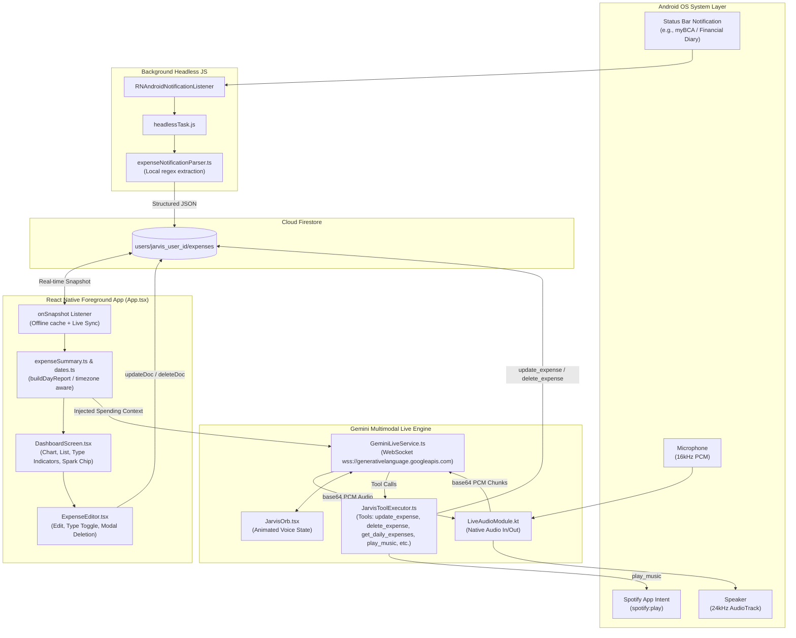
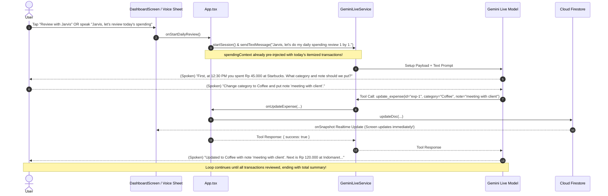

# Project Jarvis — Architecture & System Overview

> **Version**: 2.0 (Post End-of-Day Review & Expense Deletion)  
> **Last Updated**: September 14, 2026  
> **Target Platform**: Android (Bare React Native Workflow)

---

## 1. Executive Summary & Philosophy

**Project Jarvis** is an offline/cloud-hybrid personal AI assistant and smart financial companion running on Android.
The core vision is simple: provide seamless voice-driven automation, real-time banking expense tracking, and conversational intelligence **without relying on expensive proprietary smart home hubs or violating user privacy**.

### Core Non-Negotiables
1. **Strict Privacy & Zero Data Leakage**:
   - Raw bank SMS and status bar notification text **never** leaves the phone. Notification parsing is performed 100% on-device using deterministic regex patterns in JavaScript.
   - Only structured, minimal financial metadata (amount, category, merchant, bank, timestamp) is stored in Firebase Firestore.
2. **Deterministic Domain Core, Probabilistic AI**:
   - Critical math (spending totals, weekly rollups, income vs. expense net balance) is computed by deterministic pure TypeScript functions (`buildDayReport`, `buildExpenseSummary`).
   - The AI brain (Google Gemini Live) is used for high-level conversation, intent parsing, and tool execution—never as an uncontrolled black-box calculator.
3. **Android First**:
   - Leverages native Android capabilities directly: `NotificationListenerService`, Headless JS background tasks, custom 16kHz/24kHz low-latency PCM audio bridges (`LiveAudioModule.kt`), and Android deep links/intents.

---

## 2. System Architecture & End-to-End Data Flow



---

## 3. Core Subsystems

### Subsystem A: Background Notification Expense Pipeline
- **Entry point**: [headlessTask.js](file:///Users/renaldolouis/Documents/Personal/Home%20Assistant/JarvisAssistant/headlessTask.js) (registered in `index.js`).
- **Parser**: [expenseNotificationParser.ts](file:///Users/renaldolouis/Documents/Personal/Home%20Assistant/JarvisAssistant/src/notifications/expenseNotificationParser.ts).
- **Behavior**:
  - Catches notifications matching `Financial Diary` or `my financial`.
  - Supports IDR formats (`IDR 250,580.00`, `Rp 42.500`, etc.).
  - Extracts merchant/recipient, amount, bank, and transaction type (`expense` vs `income`).
  - Sets `dateSource`: prioritizes `notificationTime` (epoch milliseconds from `StatusBarNotification.getPostTime()`) over capture time.
  - Automatically polyfills `react-native-get-random-values` before calling `uuidv4()`.
  - Writes directly to Firestore `users/{JARVIS_USER_ID}/expenses/{expenseId}`.

### Subsystem B: Real-Time Financial Diary & Domain Logic
Located in `src/expenses/`:
- [types.ts](file:///Users/renaldolouis/Documents/Personal/Home%20Assistant/JarvisAssistant/src/expenses/types.ts):
  - `EditableExpense`, `ExpenseEdit`, `TransactionType ('income' | 'expense')`.
- [dates.ts](file:///Users/renaldolouis/Documents/Personal/Home%20Assistant/JarvisAssistant/src/expenses/dates.ts):
  - Strict timezone-aware day parsing (`parseDay`, `dayKey`, `startOfDay`, `addDays`).
  - Ensures midnight boundaries follow the phone's local timezone.
- [categories.ts](file:///Users/renaldolouis/Documents/Personal/Home%20Assistant/JarvisAssistant/src/expenses/categories.ts):
  - Defaults: `['Income', 'Dating', 'Uncategorized']`. Dynamically merges with existing categories seen in records.
- [expenseEditing.ts](file:///Users/renaldolouis/Documents/Personal/Home%20Assistant/JarvisAssistant/src/expenses/expenseEditing.ts):
  - Validates whole rupiah amounts (> 0), category lengths (≤ 60 chars), and notes (≤ 500 chars).
  - **Category-to-Type Synchronization**: Automatically switches `type` to `'income'` when category is set to `"Income"`, and reverts to `'expense'` when switched away. Respects explicit manual `type` overrides.
- [expenseSummary.ts](file:///Users/renaldolouis/Documents/Personal/Home%20Assistant/JarvisAssistant/src/expenses/expenseSummary.ts):
  - `buildDayReport(expenses, selectedDate)`: Produces day totals, income totals, net spend (`total - incomeTotal`), week breakdown, and Monday-first day columns.

### Subsystem C: UI / UX & Dashboard
Located in `src/screens/` and `src/components/`:
- [DashboardScreen.tsx](file:///Users/renaldolouis/Documents/Personal/Home%20Assistant/JarvisAssistant/src/screens/DashboardScreen.tsx):
  - Weekly scrollable day track with active indicator dots.
  - Spend bar chart with compact formatting (`rb`, `jt`).
  - Income badges (`Received: +Rp ...`) and Net spend calculation (`Actual spend` / `Net saved`).
  - **"Review with Jarvis"** spark chip: Trigger for the daily AI review flow.
- [ExpenseEditor.tsx](file:///Users/renaldolouis/Documents/Personal/Home%20Assistant/JarvisAssistant/src/components/ExpenseEditor.tsx):
  - Segmented Type Switcher: `Expense` vs `Income (+)`.
  - Amount, category chips, custom category input, calendar picker, and multi-line notes.
  - **In-Modal Confirmation for Deletion**: Tap "Delete expense" -> dedicated overlay asking for confirmation (`Delete` / `Cancel`) with destructive red styling.
- [JarvisOrb.tsx](file:///Users/renaldolouis/Documents/Personal/Home%20Assistant/JarvisAssistant/src/components/JarvisOrb.tsx):
  - Hardware-accelerated fluid visualizer driven by `react-native-reanimated`.
  - States: `idle`, `listening`, `thinking`, `speaking`.

### Subsystem D: Jarvis AI Brain & Real-Time Gemini Live
Located in `src/services/` and `android/.../LiveAudioModule.kt`:
- [GeminiLiveService.ts](file:///Users/renaldolouis/Documents/Personal/Home%20Assistant/JarvisAssistant/src/services/GeminiLiveService.ts):
  - Directly connects to Google Gemini Multimodal Live API over WebSocket (`wss://generativelanguage.googleapis.com/...`).
  - Handles bidirectional audio streaming:
    - Input: 16kHz PCM audio recorded by Android `AudioRecord`.
    - Output: 24kHz PCM audio played by Android `AudioTrack`.
  - **Barge-in / Interruption handling**: Stops audio playback immediately when the server signals `serverContent.interrupted === true`.
  - Provides `sendTextMessage(text: string)` to programmatically trigger turns (e.g. daily review).
- [JarvisToolExecutor.ts](file:///Users/renaldolouis/Documents/Personal/Home%20Assistant/JarvisAssistant/src/services/JarvisToolExecutor.ts):
  - Exposes function declarations to Gemini Live:
    1. `update_expense`: Update `category`, `note`, `type` in Firestore.
    2. `delete_expense`: Delete an expense by ID in Firestore.
    3. `get_daily_expenses`: Retrieve itemized transaction list for a given date.
    4. `get_daily_recap`: Spoken daily summary.
    5. `play_music`: Launch Spotify via Android deep link (`spotify:play` / `spotify:`).
    6. `control_light`: Smart light control via BLE / Wi-Fi.

---

## 4. Feature Spotlight: End-of-Day 1-by-1 Spending Review

### How It Works:


---

## 5. Codebase Directory Map

```text
JarvisAssistant/
├── App.tsx                           # Master app coordinator: Firestore subscriptions, tool execution handlers, haptics, lifecycle
├── headlessTask.js                   # Android Headless JS background entry point for notification capture
├── index.js                          # React Native app registration + headless task binding
├── android/                          # Native Android bare project
│   └── app/src/main/java/com/jarvisassistant/
│       ├── LiveAudioModule.kt        # High-performance native PCM 16kHz record & 24kHz playback bridge
│       ├── LiveAudioPackage.kt       # React Native native module package registration
│       ├── NotificationManagerModule.kt # Rebind service trigger for notification listener
│       └── MainActivity.kt / MainApplication.kt
├── src/
│   ├── components/                   # Reusable UI-thread accelerated components
│   │   ├── AnimatedPressable.tsx     # 48dp+ touch target pressable with scale physics & haptics
│   │   ├── Calendar.tsx              # Month/day picker sheet
│   │   ├── ExpenseEditor.tsx         # In-modal expense editor with Type toggle & delete confirmation
│   │   ├── GlassCard.tsx             # Translucent frosted card container
│   │   ├── Icon.tsx                  # Vector icon mapping & category color palettes
│   │   ├── JarvisOrb.tsx             # Animated Reanimated voice state orb
│   │   └── Sheet.tsx                 # Bottom sheet modal container with accessible dismiss
│   ├── config/
│   │   └── config.ts                 # Environment bindings (Gemini API keys, Live WebSocket URL builder)
│   ├── expenses/                     # Pure domain logic & math
│   │   ├── categories.ts             # Default & dynamic category normalization
│   │   ├── constants.ts              # JARVIS_USER_ID and shared constants
│   │   ├── dates.ts                  # Timezone-aware date parsing & formatting
│   │   ├── expenseEditing.ts         # Validation & Income/Expense auto-sync logic
│   │   ├── expenseSummary.ts         # buildDayReport and buildExpenseSummary math engines
│   │   └── types.ts                  # TypeScript interfaces (EditableExpense, ExpenseEdit, etc.)
│   ├── notifications/                # Device notification extraction
│   │   └── expenseNotificationParser.ts # Deterministic regex parser for bank notifications
│   ├── screens/                      # Main screen layouts
│   │   ├── DashboardScreen.tsx       # Primary spending dashboard, week chart, item list, voice sheet
│   │   └── DashboardScreen.styles.ts # Extracted styles adhering to Apple HIG & touch target rules
│   ├── services/                     # External integrations & AI
│   │   ├── GeminiLiveService.ts      # Real-time WebSocket bridge to Gemini Multimodal Live API
│   │   └── JarvisToolExecutor.ts     # Tool declarations & dispatch engine
│   └── theme/
│       └── colors.ts                 # Curated color tokens (charcoal, emerald, mint, coral)
├── __tests__/                        # Comprehensive Jest test suite (11 suites, 67 tests)
│   ├── App.test.tsx
│   ├── DashboardScreen.test.tsx
│   ├── GeminiLiveService.test.ts
│   ├── JarvisToolExecutor.test.ts
│   ├── expenseEditing.test.ts
│   ├── expenseNotificationParser.test.ts
│   ├── expenseSummary.test.ts
│   └── headlessTask.test.js
└── docs/                             # Deep-dive internal engineering guides
    ├── architecture-and-system-overview.md # THIS FILE
    ├── notification-expense-reader.md      # Headless JS & NotificationListenerService deep dive
    ├── wifi-debugging-guide.md             # Android adb Wi-Fi deployment guide
    └── ui-ux-redesign-validation.md        # Validation checklist & device testing notes
```

---

## 6. Developer & AI Quick Reference

### Running Tests & Verification
Always run these before completing any task:
```bash
# 1. Run full test suite (must be 100% green)
npm test

# 2. Run TypeScript strict check (must exit with 0 errors)
npx tsc --noEmit

# 3. Run ESLint (must pass with 0 errors/warnings)
npm run lint
```

### Critical Rules for Future AI Agents:
1. **Never bypass `expenseEditing.ts` or `expenseSummary.ts`**:
   Any new feature modifying spending math or expense updates MUST go through these pure functions and have corresponding tests in `__tests__/`.
2. **Always respect the Income / Expense distinction**:
   An item with category `'Income'` must have `type: 'income'`. In `DashboardScreen` and `expenseSummary`, income adds to `incomeTotal`, subtracts from `netSpend`, and displays with `+Rp ...`.
3. **Always document changes in `agents.md`**:
   Under the **Implementation Log / Context History** section, record date, title, and bullet points of everything changed.
